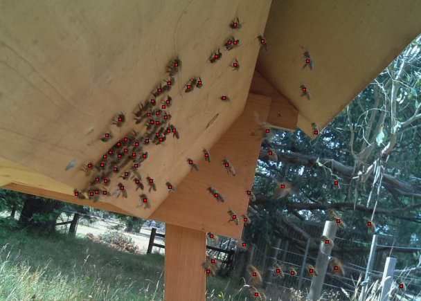

# BNN v2

unet style image translation from image of hive entrance to bitmap of location of center of bees

## label images

* left click to tag bee
* right click to untag closest bee
* 'n' for next image
* 'N' for next unlabelled image
* 'p' for previous image

```
# sample some more for labelling
ls images/2017_11_12/|shuf|head|perl -ne'chomp;print "cp images/2017_11_12/$_ images/sample_originals/train/\n"'|sh

# label
./label_ui.py --image-dir images/sample_originals/train/
```

## train

```
./train.py --batch-size 16 --patch-fraction 2 --run r1
```

```
# based on training on patches 1/2 of original (1024, 768)
input      (16, 512, 384, 3)    #589824
e1         (16, 256, 192, 8)    #393216
e2         (16, 128, 96, 16)    #196608
e3         (16, 64, 48, 32)     #98304
e4         (16, 32, 24, 32)     #24576
d1         (16, 64, 48, 32)     #98304
d1+e3      (16, 64, 48, 64)     #196608
d2         (16, 128, 96, 16)    #196608
d2+e2      (16, 128, 96, 32)    #393216
d3         (16, 256, 192, 8)    #393216
d3+e1      (16, 256, 192, 16)   #786432
logits     (16, 256, 192, 1)    #49152
```

## TODOs

* hyperparam selection; (specifically how small a model we can get away with)
* distill to something that would run on pi itself
* capture more data from other angles
* get dice loss working; should be useful?
* have been randomly sampling images to label, but we ~10,000 over a day. would it make sense to feed in labelled image with the image before/after as a way of grounding changes in background? (have found myself flipping forward/back as a way of discriminating...)


