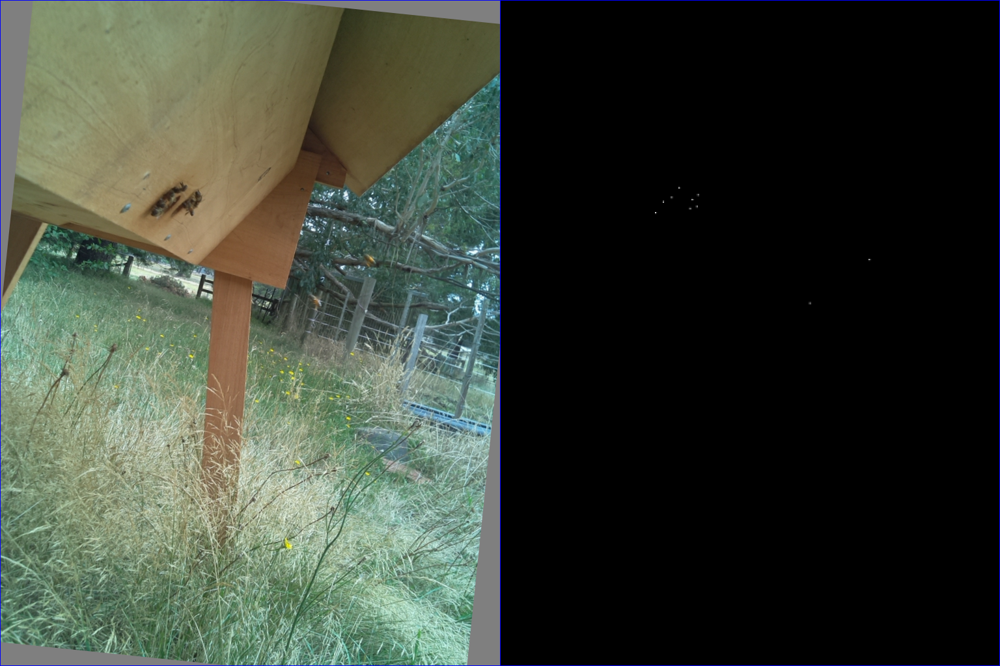

# BNN v2

unet style image translation from image of hive entrance to bitmap of location of center of bees.

trained in a semi supervised way on a desktop gpu and deployed to run in real time on the hive using
either a [raspberry pi](https://www.raspberrypi.org/) using a [neural compute stick](https://developer.movidius.com/)
or a [je vois embedded smart camera](http://jevois.org/)

see [this blog post](http://matpalm.com/blog/counting_bees/) for more info..

here's an example of predicting bee position on some held out data. the majority of examples trained had ~10 bees per image.


the ability to locate each bee means you can summarise with a count. note the spike around 4pm when the bees at this time of year come back to base.


## usage

### gathering data

the `rasp_pi` sub directory includes one method of collecting images on a raspberry pi.

### labelling

start by using the `label_ui.py` tool to manually label some images and create a sqlite `label.db`

```
./label_ui.py \
--image-dir sample_data/training/ \
--label-db sample_data/labels.db \
--width 768 --height 1024
```

hints

* left click to label the center of a bee
* right click to remove the closest label
* press up to toggle labels on / off. this can help in tricky cases.
* use left / right to move between images. it's often helpful when labelling to quickly switch back/forth between images to help distinguish background
* use whatever system your OS provides to zoom in; e.g. in ubuntu super+up / down

you can merge entries from `a.db` into `b.db` with `merge_db.py`

```
./merge_dbs.py --from-db a.db --to-db b.db
```

### training

before training we materialise a `label.db` into bitmaps with `./materialise_label_db.py`

```
./materialise_label_db.py \
--label-db sample_data/labels.db \
--directory sample_data/labels/ \
--width 768 --height 1024
```

we can visualise the training data with `data.py`

```
./data.py \
--image-dir sample_data/training/ \
--label-dir sample_data/labels/ \
--width 768 --height 1024
```



train with `train.py`.
`run` denotes the subdirectory for ckpts and tensorboard logs; e.g. `--run r12` checkpoints under `ckpts/r12/` and logs under `tb/r12`.

use `--help` to get complete list of options including model config and stopping conditions.

```
./train.py \
--run r12 \
--train-image-dir sample_data/training/ \
--label-dir sample_data/labels/ \
```

### inference

predictions can be run with `predict.py`.
to specifiy what type of output set one of the following...

* `--output-label-db` to create a label db; this can be merged with a human labelled db, using `./merge_dbs.py` for semi supervised learning
* `--export-pngs centroids` to export output bitmaps equivalent as those made by `./materialise_label_db.py`
* `--export-pngs predictions` to export explicit model output (i.e. before connected components post processing)

```
./predict.py \
--run r12 \
--image-dir sample_data/unlabelled \
--export-pngs predictions
```

### running on compute stick

( note: this still doesn't work; possibly because of something in these steps, or possibly something about the tf api
support of the stick. see [this forum post](https://ncsforum.movidius.com/discussion/692/incorrect-inference-results-from-a-minimal-tensorflow-model#latest) for more info... )

### some available datasets

* [Jonathan Byrne's](https://github.com/squeakus) [to-bee-or-not-to-bee](https://www.kaggle.com/jonathanbyrne/to-bee-or-not-to-bee) kaggle dataset